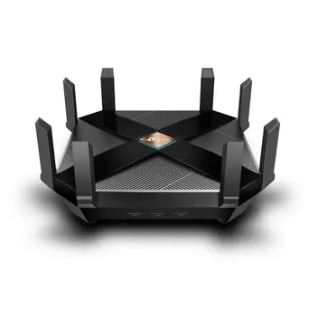

# Progamando roteador

## Archer AX6000

  

---
## Sobre o modelo

O TP-Link Archer AX6000 é um roteador potente com suporte ao Wi-Fi 6, proporcionando velocidades de até 5952 Mbps e excelente desempenho para diversas conexões simultâneas. Ele conta com um processador Quad-Core de 1.8 GHz, antenas externas para melhor cobertura, uma porta WAN de 2.5 Gbps e várias portas LAN Gigabit. Além disso, oferece segurança aprimorada com WPA3, tornando-se uma opção interessante para ambientes que exigem alta qualidade na conexão.

---

### Beneficios

- Alta Velocidade e Eficiência
- Conectividade Avançada
- Cobertura Ampliada e Estável
- Capacidade para Múltiplos Dispositivos
- Segurança Avançada
- Fácil Configuração e Gerenciamento

### Maleficios

- Problemas na banda de 2.4GHz
- Dificuldade de acesso às portas

---

## Configurando

### Network

---

### Wireless

---

### QoS

